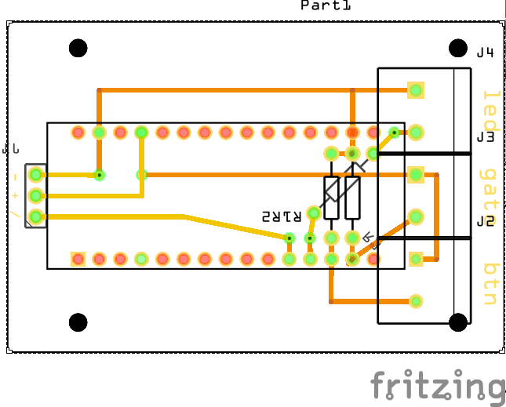

# ARDOR the hogor replacement with less Linux inside

Ardor rings the bell if someone opens the gate at my house.
But only if a activated.

Ardor runs on a Arduino nano and is quite easy to build yourself.

## Building the thing

Here is a possible PCB layout.

### Parts

* 1x [Arduino nano](https://amzn.to/2V5l5v1)
* 2x [10kΩ resistor](https://amzn.to/2ApFUrN)
* 1x [220Ω resistor](https://amzn.to/2ApFUrN)
* 1x [Relay module](https://amzn.to/2QcocCE)
* [a bunch of female pins as socket for the arduino and 3 male pins as connector for the relay](https://amzn.to/2QfA4E2)
* 3x [jumper cables for connecting the relay to the board](https://amzn.to/34QABzk)
* USB plug for powering the thing

## Hogor

Previously, [hogor](https://github.com/felixb/hogor) did the job.
But I got sick updating a linux on my door bell.
